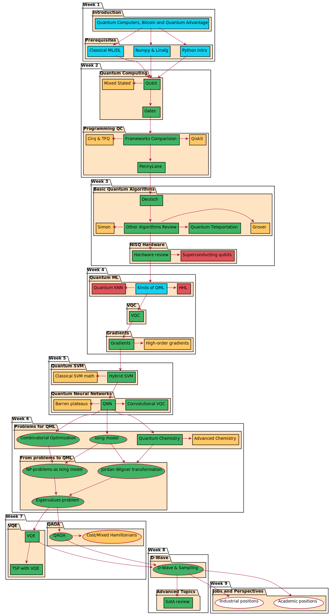

</img>

# QMLCourse
<a href="https://quantum-ods.github.io/qmlcourse/book/index.html">
    
</a>
<a href="https://ods.ai/tracks/qmlcourse">
  
</a>

<p align="left">
  <a href="https://github.com/quantum-ods/qmlcourse/blob/master/LICENSE">
    
  </a>
  <a href="https://github.com/quantum-ods/qmlcourse/discussions">
    
  </a>
  <a href="https://github.com/quantum-ods/qmlcourse/actions/workflows/pre-commit.yml">
    
  </a>
  <a href="https://github.com/quantum-ods/qmlcourse/actions/workflows/deploy-book.yml">
    
  </a>
</p>
</br>

## About

| Note: the course is under active development and, for now, is Russian-only! |
| --------------------------------------------------------------------------- |


This is the main repository of the course.

- [QMLCourse](#qmlcourse)
  - [About](#about)
  - [Build the book](#build-the-book)
  - [Contributing Guide](#contributing-guide)
  - [Discussions](#discussions)
  - [Course Program](#course-program)
    - [How to read the schema?](#how-to-read-the-schema)
  - [Team](#team)
  - [Join ODS](#join-ods)
  - [Similar Projects](#similar-projects)
  - [Bibtex](#bibtex)
  - [Legal Issues](#legal-issues)

## Build the book

Building the PDF-version of the book is very time-expensive and could not be automated via GutHub actions. If you want the PDF-version of the book you should run the following commands:

Linux, xelatex:
```
git clone https://github.com/quantum-ods/qmlcourse.git
cd qmlcourse
git checkout gh-pages
cd _build/latex
xelatex -interaction nonstopmode qmlcourseRU.tex
```

## Contributing Guide

Refer to [Contributing Guide](./CONTRIBUTING.md) for the definition of all contributor roles.

## Discussions

Some ideas, suggestions, remarks, etc. you can write on a separate page [here](https://github.com/quantum-ods/qmlcourse/discussions).

## Course Program



### How to read the schema?

- **BLUE** &mdash; introductory blocks covering prerequisites for the rest of the course;
- **GREEN** &mdash; the main flow of the course with simple introductory lectures on QC and QML;
- **YELLOW** &mdash; highly recommended facultative lectures which explain additional topics about QML and QC;
- **RED** &mdash; advanced-level lectures that deeply explain the math and the principles underlying QML.
- **WHITE** &mdash; career in quantum computations and quantum QML

## Team

The main authors, reviewers, editors, DevOps you can find [here](https://quantum-ods.github.io/qmlcourse/book/authors.html).

Content generators, to be agreed with [@SemyonSinchenko](https://github.com/SemyonSinchenko). See [Issues](https://github.com/quantum-ods/qmlcourse.ai/issues) to pick up one of the open tasks and for updates; this list is not intended to be always up-to-date.

Also, all authors for some updates are participants special channel into community [ods.ai](http://ods.ai), join filling the form and write your nickname to orgs to add you to the channel.

## Join ODS

To join the ODS-community slack you need to fill the form [here](https://ods.ai/join-community). After filling the form contact us via [email](mailto:qmlcourse.ods@gmail.com) and send the ODS registration email and date of the registration. After that, we add you to the closed channel in the ODS Slack.

## Similar Projects

- [QuantumAlgorithms.org](https://github.com/Scinawa/quantumalgorithms.org) [ENG]: lecture notes for students about quantum algorithms and quantum machine learning. Compared to this project our lectures are more practice and programming-oriented. In our course, there are more entry-level and sci-pop lectures but in QuantumAlgorithms.org there are more hard math and strong proofs of theorems. Also, we pay less attention to fully-quantum algorithms and ML but pay more attention to the variational and hybrid quantum-classical things.
- [Qiskit-textbook](https://github.com/qiskit-community/qiskit-textbook) [ENG]: a textbook about learning quantum computing with qiskit. Compared to this project our course is more about ML, not the quantum protocols and algorithms. Also, we use `PennyLane` as the main quantum framework because it could be used with different backends including `Qiskit` and `CirQ`.
- [CERN Introductory Course](https://home.cern/news/announcement/computing/online-introductory-lectures-quantum-computing-6-november) [ENG]: A series of weekly lectures on the basics of quantum computing. The talks focus on the practical aspects of quantum computing and are organised by CERN openlab and the CERN Quantum Technology Initiative. They are given by Elias Fernandez-Combarro Alvarez, an associate professor in the Computer Science Department at the University of Oviedo in Spain since 2009 and a cooperation associate at CERN since earlier this year. Compared to that lectures our course is more practice and programming oriented. Also our course is open source and maintained by community compared to the CERN course which is maintained by the author Dr. Alvarez.
- [CERN Introductory Course (adopted version in russian)](https://russol.info/quantum) [RU]: The same as above but in russian and better adopted for entry-level poeple. Lectures are splitted to short parts and notes are commented and illustrated.

## Bibtex

```bibtex
@misc{qmlcourse2021,
  author = {Sinchenko, Semyon and Kashnitsky, Yury and Trokhymenko, Viktor and Dmitry, Bazhanov and Berezutskii, Aleksandr and Zimka, Boris and Besedin, Ilya and Dmitry, Burdeiny and Zheltonozhskii, Evgenii and Karelin, Nikolay and Kotenkov, Igor and Andrey, Lukyanenko and Ovsyannikova, Alexandra and Ozerin, Alexe and Vadzim, Piatrou and Alexey, Pronkin and Karina, Reshetova and Leonid, Senderovich and Igor, Tokarev and Shirkin, Sergei and Mikita, Shchutski and Dani, El-Ayyass and Markova, Natalya and Korzhov, Dmitry and},
  title = {Quantum Machine Learning Course},
  year = {2021},
  publisher = {GitHub},
  howpublished = {\url{https://github.com/quantum-ods/qmlcourse}},
}
```

## Legal Issues

You can communicate with course orgs via [email](mailto:qmlcourse.ods@gmail.com). Please email us first if you found an intellectual property rights violation in the course materials or if you want to use the course materials, not under the CC-BY-4.0 License.
