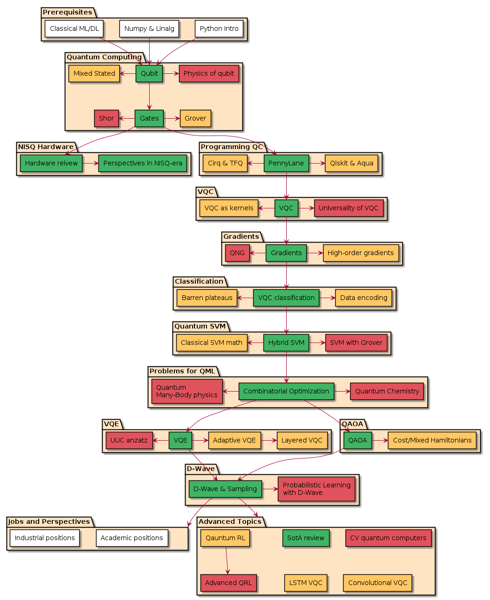

# QMLCourse

| Note: the course is under active development and, for now, is Russian-only!|
| --- |

Main links (Russian-only):
- **[The latest build](https://semyonsinchenko.github.io/qmlcourse/_build/html/book/index.html)** of a Jupyter Book with course content
- **[ODS.ai track "qmlcourse"](https://ods.ai/tracks/qmlcourse)** – this will be the main page of the course

This is the main repository of the course.

1. [Contributing Guide](#contributing-guide)
3. [Discussions](#discussions)
2. [Course Program](#course-program)
4. [Team](#team)
5. [Bibtex Citations](#bibtex)

## Contributing Guide

- [Contributing Guide](./CONTRIBUTING.md)

## Discussions

- Some ideas, suggestions, remarks, etc. yuo can write at the separate page [here](https://github.com/SemyonSinchenko/qmlcourse/discussions)

## Course Program



### How to read the schema?

- **WHITE** - introductory blocks covering prerequisites for the rest of the course;
- **GREEN** - main flow of the course with simple introductory lectures on QC and QML;
- **YELLOW** - highly recommended facultative lectures which explain additional topics about QML and QC;
- **RED** - advanced level lectures which deeply explain the math and the principles underlying QML.

## Team

### Contributor roles

Here we list all team members according to their contributor roles. Refer to [CONTRIBUTING.md](https://github.com/SemyonSinchenko/qmlcourse.ai/blob/master/CONTRIBUTING.md) for the definition of all contributor roles.

### Benevolent Dictator

Semyon Sinchenko, @sem

### Core reviewers

* @gamlo
* @Sergei Shirkin
* @Pola Ron

To be extended based on the actual commitment and qualification of all contributors.

### Reviewers

By default that's everyone who is invited to the #org\_qml\_course Slack channel.

### Authors

Content generators, to be agreed with Benevolent Dictator. See [Issues](https://github.com/SemyonSinchenko/qmlcourse.ai/issues) to pick up one of the open tasks and for updates; this list is not indended to be always up-to-date.

Also, all authors for some updates are participants special channel into community ods.ai, join filling the form and write your nickname orgs to add you to the channel.

* @stm (Python)
* @maruschin (Python)
* @sharthZ23 (Python, NumPy)
* @alex.ozerin (NumPy, math)
* @yorko (ML intro)
* @Pola Ron (quantum enthropy)
* @gamlo (hardware)
* @Sergei Shirkin (PennyLane)
* @sem (multiple lectures)

### Editors

* @nmarkova
* @vitaliylyalin7000

### Orgs

* @yorko
* @vtrohymenko

## Bibtex

```bibtex
@misc{qmlcourse2021,
  author = {Sinchenko SA et al.},
  title = {QMLCourse},
  year = {2021},
  publisher = {GitHub},
  journal = {GitHub repository},
  howpublished = {\url{https://github.com/SemyonSinchenko/qmlcourse.ai}},
}
```
