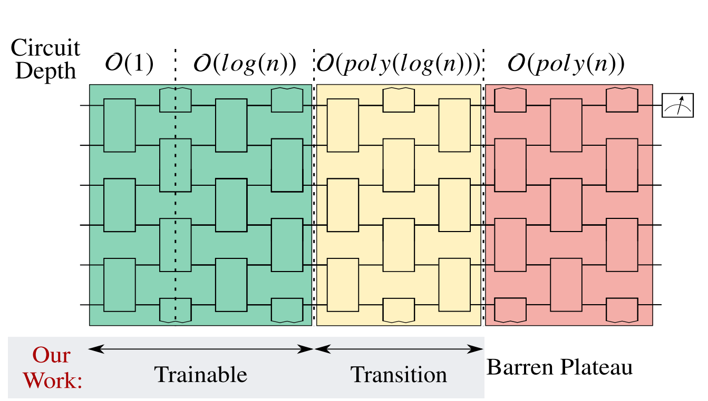

---
jupytext:
  formats: md:myst
  text_representation:
    extension: .md
    format_name: myst
kernelspec:
  display_name: Python 3
  language: python
  name: python3
---

# The barren plateau phenomenon

## Description of the lecture

In this lecture, we will learn about the barren plateau phenomenon. It is a common pittfall of many VQC architectures, for which an exponentially vanishing gradient hinders the optimization process. In particular, we will try to answer the following questions:
* What is the barren plateau phenomenon?
* Under which conditions can barren plateaus occur?
* What strategies can we adopt to avoid them?

## Introduction

Variational algorithms have emerged as a central class of quantum algorithms for NISQ devices. They can be used to solve a large variety of problems, from finding the ground-state of a Hamiltonian in quantum chemistry, material science or combinatorial optimization to solving machine learning problems with quantum neural networks. However, the elephant in the room is that we basically don't know if they can solve problems that classical computers couldn't solve as efficiently. Indeed, variational algorithms can be victim of two kinds of issues:

- **Low-expressiveness**: the variational circuit cannot efficiently represent the states or functions of interest. For instance, a ansatz for VQE might need an exponential number of gates/layers to be able to approximate the ground state of interesting Hamiltonians (i.e. Hamiltonians that cannot be efficiently simulated with classical tensor network or Monte Carlo techniques).
- **Bad trainability**: it takes an exponential time (or an exponential precision in the measurement process) to find the correct parameters of the variational ansatz.

Trainability is the topic of today. What do we know about the optimization of variational circuits that could make them less trainable than, let's say, regular neural networks? This question was studied for the first time by a [team at Google](https://arxiv.org/abs/1803.11173) who introduced the main tool to study this question, namely the **barren plateau phenomenon**. Such phenomenon occurs whenever the gradient of a randomly-initialized parametrized quantum circuit gets exponentially close to $0$ when increasing the number of qubits. The presence of small gradients tends to make the optimization problem extremely difficult for large systems, as it means that the landscape of the function we want to optimize is mostly flat, or *barren*. Finding a good descent direction at each optimization step is therefore a laborious process. The presence or absence of barren plateaus is influenced by many aspects of variational architectures: the [type of ansatz](https://arxiv.org/abs/2011.02966), the [number of layers](https://arxiv.org/abs/2001.00550), the [cost function](https://arxiv.org/abs/2001.00550), the [strength of noise](https://arxiv.org/abs/2007.14384) and [entanglement](https://arxiv.org/abs/2010.15968), the [initialization strategy](https://arxiv.org/abs/1903.05076), etc.

We will explore here those different features of barren plateaus, with the goal of helping you identify if any architecture you're considering might exhibit this phenomenon. Let's start by giving a more precise definition of barren plateaus and go through some simple examples.

## What is a barren plateau?

> **Definition:** a variational circuit on $n$ qubits is said to have a *barren plateau phenomenon* if, when initialized randomly, the gradient of its cost function is concentrated around $0$ with a variance that decreases exponentially with $n$.


Let's unwrap this definition. First of all, the barren plateau is a random phenomenon, meaning that it can only be quantified when considering a random distribution of variational parameters, and will strongly depend on the properties of this distribution. Whether gradients are still small in the middle of the optimization process is harder to prove. Secondly, the presence or absence of a barren plateau depends on both the ansatz and the cost-function. Changing the cost-function or the ansatz used to solve a given problem can therefore serve as a mitigation strategy to avoid barren plateaus. Finally, the barren plateau is an asymptotic phenomenon, and by convention only occurs when the gradient is *exponentially* decaying with the number of qubits. It is something important to notice as a polynomially-vanishing gradient could potentially destroy certain types of quantum advantage without being called barren plateau in the current terminology.

Hands-on code example here.
```{code-cell} ipython3
visualize_barren_plateau()
```

So, why do we care about barren plateaus? Because the properties of the gradients have a large influence on the optimization process. Let's imagine that you are optimizing your cost-function using gradient-descent. Then you need to compute the gradient at each step. If the gradient is exponentially close to zero, we will need an exponential precision to compute it, and that sucks. As we will see later, this issue can also arise when considering gradient-free methods, so the problem is not only about some particular gradient descent algorithms, but really about the landscape of the cost-function.

## When do we have barren plateaus?

### When the circuit distribution is a 2-design

[Insert figure with a big unitary matrix]

"When the circuit distribution is a what?". Let's unravel those terms, which are crucial to understand the essence of barren plateaus.

#### Haar measure and 2-designs

Let's say you have a certain parametrized quantum circuit.
It can be represented by a unitary matrix $U(\theta)$ depending on some parameters $\theta$.
You then need to specify a distribution to initialize your circuit.
For instance, you could choose to pick your $\theta$s uniformly between $0$ and $2\pi$.
Or have a Gaussian distribution centered around $0$.
In any case, this distribution over the parameters will induce a distribution over unitary matrices:
each time you initialize your circuit, you get a different unitary $U$ that has a certain probability density $p(U)$.
And we're lucky, there is an entire field, called *random matrix theory*, that studies those distribution over matrices, and in particular over unitary matrices.
For example, in random matrix theory, the equivalent of the uniform distribution is called the **Haar measure**.
The Haar measure over the unitary group $\mathcal{U}(n)$ is defined as the unique probability distribution $p_{\text{Haar}}$ such that

\begin{equation}
  \forall U, V \in \mathcal{U}(n), p_{\text{Haar}}(UV)=p_{\text{Haar}}(VU)=p_{\text{Haar}}(U)
\end{equation}

It means that moving around the unitary group does not change the density, or in other words, all unitary matrices have equal probability.
While algorithms exist to sample unitary matrices over the Haar distribution, most quantum circuit initialization schemes are based on parameter initialization and do not directly follow the Haar measure. However, they can often approximate it.

A particular type of approximation of the Haar measure is formed by the so-called **$t$-designs**. A distribution $p$ over the unitary group is a $t$-design if all its moments up to $t$ (expectation, variance, etc.) are equal to those of the Haar measure. More formally, for any polynomial function $f$ of degree $t$, we should have:

$$
  \mathbb{E}_{U \sim p_{\text{Haar}}}[f(U)]=\mathbb{E}_{U \sim p}[f(U)]
$$

Sometimes, you'll also find in the literature the definition of a $t$-design written as

$$
  \forall M, \, \int (U^{\dagger})^{\otimes t} M U^{\otimes t} dp(U) = \int (U^{\dagger})^{\otimes t} M U^{\otimes t} dp_{\text{Haar}}(U)
$$

or

$$
  \forall M, \, \frac{1}{N} \sum_k (U_k^{\dagger})^{\otimes t} M U_k^{\otimes t} = \int (U^{\dagger})^{\otimes t} M U^{\otimes t} dp_{\text{Haar}}(U)
$$

which is just the explicit form of the equation above, when the distribution is respectively continuous or discrete and $M$ is the matrix representing the polynomial we want to take. In particular, $2$-designs are distributions that have the same expectation and variance as the Haar measure, and they appear everywhere in quantum information. For instance, if you construct a circuit by randomly inserting Clifford gates (H, CNOT, S), you'll eventually get a 2-design [TODO: make those statements more precise]

#### 2-designs and barren plateaus

So what's the link between 2-designs and barren plateaus? It happens that whenever your circuit distribution follows a 2-design, you'll get a barren plateau. That statement was proved in the [first paper on barren plateau](https://arxiv.org/abs/1803.11173) and takes the following more precise form:

> **Theorem:** let $U(\theta)$ a parametrized quantum circuit, $U_k=e^{iA\theta_k}$ a particular gate in the circuit, $\rho$ the input density matrix and $E(\theta)=\text{Tr}[HU(\theta)\rho U^\dagger(\theta)]$ the cost function we are trying to optimize. Then, if the unitaries before and after $U_k$ follow a 2-design, we will have as the number of qubits $n \rightarrow \infty$:
>
> $$\mathbb{E}[\partial_k E]=0$$
>
> $$\text{Var}[\partial_k E] \sim - \frac{2}{2^{3n}} \text{Tr}[\rho^2] \text{Tr}[H^2] \text{Tr}[A^2]$$

So in other words, randomly initializing a quantum circuit such that the resulting distribution is a 2-design will directly give you exponentially vanishing gradients. The trace terms appearing in the variance usually don't contribute too much to the overall scaling. Indeed, taking VQE as an example, the intial density matrix is usually taken to be $\rho = |0\rangle \langle 0 |$ for which $\text{Tr}[\rho^2]=1$. Gates are usually rotations, in which case $A$ is a pauli matrix, fullfilling $\text{Tr}[A^2]=n$. Finally, if $H$ is a sum of local terms (e.g. an Ising Hamiltonian), we can also show that $\text{Tr}[H^2]$ won't have any influence on the scaling.

<!-- While proving this theorem is out-of-scope for this lecture, let's try to give some intuition using the notion of concentration of measure.

#### Concentration of measure -->


### When the number of layers is high

At this point of the lecture, you might be thinking that this 2-design assumption doesn't help you much in knowing whether your particular variational architecture has a barren plateau or not. Indeed, how to know if your ansatz and initialization scheme give rise to a 2-design?

The first hint concerns the number of layers.
Indeed, a known procedure to create a 2-design is to build a circuit with a polynomial number of random 2-qubit gates. The precise nature of the polynomial depends on the dimension of the lattice underlying your qubits (considering that you can only put a gate between neighboring qubits). For a lattice of dimension $d$, having $O(n^{1/d})$ random gates gives you an approximate 2-design (see [Harrow and Mehraban, 2018](https://arxiv.org/abs/1809.06957)). So, while having a high-dimensional lattice is advantageous from an expressiveness perspective (you can build more circuits at a given depth), it will kill your gradients with a higher probability.

This statement was made rigorous in [Cerezo et al, 2020](https://arxiv.org/abs/2001.00550), for a particular type of 1D ansatz: the hardware-efficient ansatz (HEA), sometimes also called alternating layer ansatz. Here is a representation of the HEA, along with the scaling laws demonstrated in the paper:



We can see that the ansatz is indeed one-dimensional: each qubit is only connected to two other qubits. Moreover, each layer is a depth-two circuit made of gates between all the neighboring qubits. The name "hardware-efficient" comes from the combination of those two properties: 1D lattices can easily be realised on real hardware, and gates are efficiently lay out in the circuit.

In [Cerezo et al, 2020](https://arxiv.org/abs/2001.00550), the authors show that if each $2$-qubit unitary of the HEA follows a 2-design and if your cost function is local (more on that later), then you will **not** have any barren plateau if the number of layers grows as $O(log(n))$ (where $n$ is the number of qubits). On the other hand, you will have one if the number of layers grows as $O(poly(n))$. While those laws were only proven in the context of the HEA, they are likely to hold for other types of ansatzes.


### When the cost function is global

In the previous discussion, we assumed that the cost function was local. Let's explain what we mean by that. In many variational algorithm, the cost function can be written as

$$
f(\theta)=\text{Tr}[H \rho_{\theta}]
$$

where $\rho_{\theta}$ is the output of the quantum circuit (which depends on the gate parameters $\theta$). We say that the cost function is local if $H$ can be written as a sum of "local" terms, i.e. terms that only involve a constant number of qubits. For instance, the Ising model

$$
H=\sum_{i,j} J_{ij} Z_i Z_j
$$

is local (since each term $Z_i Z_j$ only involves two qubits), while a Hamiltonian like

$$
H=Z^{\otimes n}
$$

is global.

A second result from the paper mentionned previously is that global cost functions can lead to barren plateaus for all circuit depths (including constant-depth).

Where do global cost functions appear in variational algorithms? An important example is when maximizing the fidelity between the output of your circuit and a given reference state. For instance, imagine that you want to prepare a state $|\psi\rangle$ at the end of your variational circuit. You can do that by maximizing the fidelity

$$
F(\psi,\psi_{\theta}) = |\langle \psi | \psi_{\theta} \rangle|^2 = \text{Tr}[|\psi\rangle \langle \psi | \rho_{\theta}]
$$

where $\rho_{\theta}=|\psi_{\theta}\rangle \langle \psi_{\theta} |$ is the output of the circuit. This corresponds to minimizing the cost function corresponding to the "Hamiltonian":

$$
H=-|\psi\rangle \langle \psi|
$$

which will often be a global cost function. For instance, if $|\psi\rangle$ is the zero state, it can be written

$$
H=-|0\rangle\langle 0|^{\otimes n},
$$

which involves all the qubits and is therefore global. We will see later how to turn this type of global cost functions into local ones, in order to mitigate the resulting barren plateau problem.

### When noise is present

Discussion of the noise-induced BP paper

### When hidden and visible layers of QNNs are highly entangled

Specific to a particular QNN architecture as well as QRBM.

## How to mitigate the barren plateau phenomenon?

### Global to local cost function

Example of the fidelity.

### Architectures with a logarithmic number of layers

Example of the QCNN

### Initialization strategies

Paper by UCL team. However, unlikely to really help, see next section.

## Landscape of variational circuits

Is there any hope of finding better gradients by initializing circuits differently, or choosing different optimizers than gradient descent?
Unfortunately, evidence seem to converge to a negative answer: the barren plateau phenomenon is not fundamentally about random gradients or 2-designs, it is about the optimization landscape of variational circuits. If the gradient of random circuits is exponentially small with a high probability, it means that a significant part of the landscape is basically flat. It implies that whatever optimization method you choose (gradient-free, second-order, etc.), you will have a hard time navigate the landscape towards a global minimum. It also means that the only initialization strategies that are likely to help are the ones that already bring you very close to a global minimum, but finding such strategy might be as hard as finding the minimum itself. This idea that flat landscapes are the essence of barren plateau was made more precise in a series of papers that we will discuss now.

### Barren plateaus and narrow gorges

### Could gradient-free or second-order optimizers help navigate the landscape?

No.

### Expressibility vs trainability

## Conclusion

## Resources

* [Pennylane tutorial on barren plateaus](https://pennylane.ai/qml/demos/tutorial_barren_plateaus.html)
* [Pennylane tutorial on the Haar measure](https://pennylane.ai/qml/demos/tutorial_haar_measure.html)
* [A short introduction to unitary t-designs](https://glassnotes.github.io/OliviaDiMatteo_Unitary2Designs.pdf)

## Appendix: the maths of barren plateaus

### Computing gradients

### Computing expectations: Weingarten calculus

Hands-on example with RTNI in Python.
